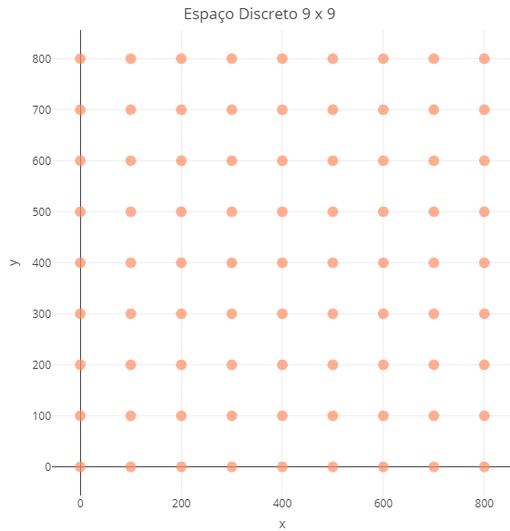

 
## Desenho do Algoritmo 
 
* Testes dos Espaços:
  * Espaços discretos menores que $M_{(8,8)}$ não apresentaram solução ótima.
  * Espaços maiores que $M_{(150,150)}$ apresentaram custo computacional muito elevado.
   
* Implementação:    
  * O algorítimo foi desenhado para escanear os espaços discretos de $M_{(8,8)}$ até $M_{(150,150)}$ na área de __800 x 800__ com intervalos iguais entre os pontos.
  * Para ilustrar, foi considerado o espaço de $M_{(9,9)}$, que representa 81 possíveis localizações para os __Pa's__.

## Gráfico do Espaço de Busca

<center>

{width=60%, height=60%}

</center>

## Iterações do Algoritmo 

* Laço:
  * A cada iteração o algoritmo inspeciona cada coordenada do espaço discretizado de possíveis localizações dos __Pa's__ e determina o __PA__ que cobre o maior número de __Pd's__. 
  * Se a condição de __150 Mbps__ não for violada, o índice do __PA__ com maior cobertura de __Pd's__ é armazenado e esses __Pd's__ são removidos.
  * O algoritmo reinicia a busca do próximo __PA__ que cobre mais __Pd's__ dentre os restantes.

* Critério de Parada:
  * O algoritmo para quando cobre pelo menos __475__ dos __500 Pd's__ atendendo as restrições de consumo de banda e limite de __Pa's__.


## Primeira Iteração

* O algoritmo conta o número de __Pd's__ cobertos por cada uma das __81__ possíveis localizações para o __1º PA__ e soma os __Mbps__ demandados.

* O máximo de __202 Pd's__ são cobertos pelo __PA__ nas coordenadas __(200, 200)__.

* O total de __146 Mbps__ de demanda desses __Pd's__ não viola a condição de menor que __150__ Mbps.  

* As coordenadas deste __1º PA__ são armazenadas.

* Os __202 Pd's__ cobertos por este __PA__ são __removidos__ por já estarem cobertos.

##

<center>

```{r, warning=F, echo = F, message=F, error=F, fig.align='right', fig.width=7, fig.height=6}

# Carrega Bibliotecas
library(tidyverse)
library(plotly)

# Declara possíveis posições para os pontos de acesso
centro_x <- rep(c(0,100,200,300,400,500,600,700,800), times = 9)  
centro_y <- rep(c(0,100,200,300,400,500,600,700,800), each = 9) 

# Declara data frame do grid
grid_9_9 <- tibble(x = centro_x,
                   y = centro_y)

# Importa dados
wlan_completa <- read_csv("https://raw.githubusercontent.com/Protospi/WLAN/main/dados/clientes.csv",
                          col_names = c("x", "y", "Mbps"))

# Insere colunas de indice
wlan1 <- wlan_completa %>%
  mutate(indice = 1:nrow(wlan_completa))

# Declara vetor que armazena resultasdos
contagem1 <- tibble(Contagem = numeric(81),
                    Mbps = numeric(81))

# Declara Limite 
limite <- 85^2

# Laco para determinar maior contagem
for(i in 1:81){
  
  # Declara total
  total1 = 0
  
  # Declara total de Mbps1
  Mbps1 <- 0
  
  # Laco para pontos
  for(j in 1:500){
    
    # Calcula soma da diferenca de quadrados
    dist1 <-  (wlan1$x[j] - centro_x[i])^2 + (wlan1$y[j] - centro_y[i])^2 
    
    # Condicao de pertenciamento ai raio da wlan
    if(dist1 <= limite){
      
      # Incrementa total de Pd's
      total1 <- total1 + 1
      
      # Incrementa total de Mbps
      Mbps1 <- Mbps1 + wlan1$Mbps[j]
      
    }
    
  }
  
  # Popula total de Pd's atendidos pelo Pa i 
  contagem1[i, "Contagem"] <- total1
  
  # Popula total de Pd's atendidos pelo Pa i
  contagem1[i, "Mbps"] <- Mbps1
  
}

# Carrega dados
wlan1 <- tibble(Pa = rep(1,500)) %>%
  bind_cols(read_csv("https://raw.githubusercontent.com/Protospi/WLAN/main/dados/clientes.csv",
                     col_names = c("x", "y", "consumo")))

# primeiro grid
grid1 <- tibble(Pa = 2:82,
                x = rep(c(0,100,200,300,400,500,600,700,800), times = 9),
                y = rep(c(0,100,200,300,400,500,600,700,800), each = 9),
                consumo = rep(100, 81),
                Pd = contagem1$Contagem,
                Mbps = round(contagem1$Mbps, 1))

# Declara Grafico
base1 <- wlan1 %>%
  plot_ly(x = ~x, 
          y = ~y,
          size = ~consumo,
          type = "scatter",
          alpha = 0.8,
          name = "Pontos de Demanda") %>% 
  add_markers(
    showlegend = F,
    alpha = 0.3,
    alpha_stroke = 0.3,
    marker=list(color = 'rgb(0,191,255)'),
    name = "Pontos de Demanda",
  ) %>%
  add_markers(frame = ~paste0(sprintf("%02d", Pa-1), " = ", Pd, " Pd's = ", Mbps, " Mbps"),
              marker=list(sizeref=0.035,
                          sizemode="area",
                          color = 'rgb(255,140,0)'),
              alpha= 0.01,
              data = grid1,
              name = "Pontos de Acesso") %>%
  animation_opts(500,  transition = 1, easing = "exp-out") %>% 
  animation_slider(
    currentvalue = list(prefix = "Pa: ",
                        font = list(color="orange"),
                        xanchor = "center")
  ) %>% 
  layout(legend = list(x = 100, y = 0.5),
         title = list(text = 'Primeira Iteração'),
         xaxis= list(title = list(text = "x",
                                  standoff = 10L))) %>% 
  config(displayModeBar = F)

# Desenha Grafico
base1

```

</center>

## Segunda Iteração

* O algoritmo realiza a mesma busca e contagem da primeira iteração, porém desconsiderando os __Pd's__ cobertos pelo __1º PA__.

* O máximo de __199 Pd's__ são cobertos pelo __PA__ nas coordenadas __(600, 600)__.

* O total de __141 Mbps__ de demanda destes __Pd's__ não viola a condição de menor que __150 Mbps__. 

* Da mesma forma são armazenadas as coordenadas desse __2º PA__. 

* Os __199 Pd's__ cobertos por este __PA__ também são __removidos por__ já estarem cobertos.

## 

<center>

```{r, warning=F, echo = F, message=F, error=F, fig.align="center", fig.width=7, fig.height=6}

# Importa dados
wlan_completa <- read_csv("https://raw.githubusercontent.com/Protospi/WLAN/main/dados/clientes.csv",
                          col_names = c("x", "y", "Mbps"))

# Insere colunas de indice
wlan1 <- wlan_completa %>%
  mutate(indice = 1:nrow(wlan_completa))


# Recupera indices
indices1 <- NULL

# Laco para pontos
for(j in 1:500){
  
  # Calcula soma da diferenca de quadrados
  dist1 <- (wlan1$x[j] - centro_x[21])^2 + (wlan1$y[j] - centro_y[21])^2 
  
  # Condicao de pertenciamento ai raio da wlan
  if(dist1 <= limite){
    
    # Incrementa total de Pd's
    indices1 <- c(indices1, j)
    
  }
  
}

# Carrega dados depois da primeira remocao
wlan2 <- wlan1[-indices1,]

# Declara vetor que armazena resultasdos
contagem2 <- tibble(Contagem = numeric(81),
                    Mbps = numeric(81))

# Laco para determinar maior contagem
for(i in 1:81){
  
  # Declara total
  total2 <- 0
  
  # Declara total de Mbps1
  Mbps2 <- 0
  
  # Laco para pontos
  for(j in 1:nrow(wlan2)){
    
    # Calcula soma da diferenca de quadrados
    dist2 <-  (wlan2$x[j] - centro_x[i])^2 + (wlan2$y[j] - centro_y[i])^2 
    
    # Condicao de pertenciamento ai raio da wlan
    if(dist2 <= limite){
      
      # Incrementa total de Pd's
      total2 <- total2 + 1
      
      # Incrementa total de Mbps
      Mbps2 <- Mbps2 + wlan2$Mbps[j]
      
    }
    
  }
  
  # Popula total de Pd's atendidos pelo Pa i 
  contagem2[i, "Contagem"] <- total2
  
  # Popula total de Pd's atendidos pelo Pa i
  contagem2[i, "Mbps"] <- Mbps2
  
}

# primeiro grid
grid2 <- tibble(Pa = 2:82,
                x = rep(c(0,100,200,300,400,500,600,700,800), times = 9),
                y = rep(c(0,100,200,300,400,500,600,700,800), each = 9),
                consumo = rep(100, 81),
                Pd = contagem2$Contagem,
                Mbps = round(contagem2$Mbps, 1))

# Carrega dados
wlan1 <- tibble(Pa = rep(1,500)) %>%
  bind_cols(read_csv("https://raw.githubusercontent.com/Protospi/WLAN/main/dados/clientes.csv",
                     col_names = c("x", "y", "consumo")))

# Carrega dados depois da primeira remocao
wlan2 <- wlan1[-indices1,]


# Declara Grafico
base2 <- wlan2 %>%
  plot_ly(x = ~x, 
          y = ~y,
          size = ~consumo,
          type = "scatter",
          alpha = 0.8,
          name = "Pontos de Demanda") %>% 
  add_markers(
    showlegend = F,
    alpha = 0.3,
    alpha_stroke = 0.3,
    marker=list(color = 'rgb(0,191,255)'),
    name = "Pontos de Demanda",
  ) %>%
  add_markers(frame = ~paste0(sprintf("%02d", Pa-1), " = ", Pd, " Pd's = ", Mbps, " Mbps"),
              marker=list(sizeref=0.035,
                          sizemode="area",
                          color = 'rgb(255,140,0)'),
              alpha= 0.01,
              data = grid2,
              name = "Pontos de Acesso") %>%
  animation_opts(500,  transition = 1, easing = "exp-out") %>% 
  animation_slider(
    currentvalue = list(prefix = "Pa: ",
                        font = list(color="orange"),
                        xanchor = "center")
  ) %>% 
  layout(legend = list(x = 100, y = 0.5),
         title = list(text = 'Segunda Iteração'),
         xaxis= list(title = list(text = "x",
                                  standoff = 10L))) %>% 
  config(displayModeBar = F)

# Desenha grafico
base2


```

</center>

## Decima Sétima Iteração

* O algoritmo para. 

* O resultado da busca retorna uma solução no mínimo local de __17 PA´s__.

* A condição de que sejam cobertos __95%__ ou __475__ do total de __500 Pd's__ é atendida.

* A restrição de número de __Pa's__ menor que __100__ é atendida.

* A restrição de que a soma da demanda dos __Pd's__ cobertos por um __Pa__ não exceda __150 Mbps__ é atendida.

* As informações dos __índices__, número de __Pd's__ atendidos e total da demanda em __Mbps__ de cada __Pa__ podem ser recuperadas.


